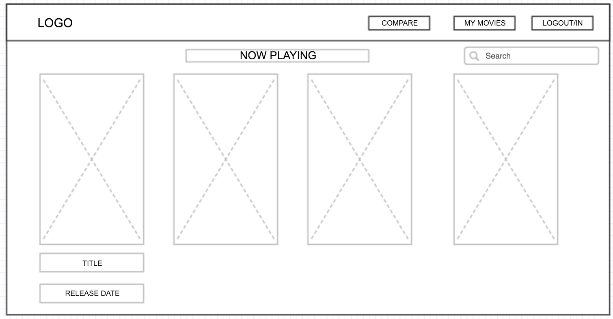

# Movie Index

Built using the MEAN stack, Movie Index provides movie data and information in a more dynamic and visually interactive way than other sites of its sort.

[Trello Board](https://trello.com/b/EhMZSFFy/wdi-project4)

## Installation
* Download the zip file or clone this repo to your local computer
* Cd inside the root of the directory and run 'npm install'
* You will need to get an API key for The Movie Database and setup the correct environment variables to make the API functional
* Create a .env file to hold all of your API keys and JWT secret

## Wireframes

## User Stories

| As a User I want:  | Goal:           |
| -------------       |-------------|
| To be able to access data about movies  | To gain more information about a movie |
| My profile to be secure and private | To be the only one who can access my content    |
| To add movies to my profile page| To look at and compare data with other films later   |
| To see details and graphs on each movie's page | To learn more about the movie and visually see different data  |
| To go to see upcoming and now playing films when I go to the site | To be up to date with the movies that are out   |
| To see similar films of each film I click on| To see and learn about other films like the one I searched|
| To be able to click on a movie and be brought to its main page| To see as much information about a film as possible |
| To be able to click on a movie and be brought to its main page|  |
| To be able to search for movies| To get information about any film I want |
| To see posters for all of the movies | To be able to have a visual idea of the movie |
| To compare all movies on my profile page| To get a good idea of where all films rank |

## Technologies Used
* Node.js
* Express
* MongoDB
* AngularJS
* D3.js
  * Curtis Bratton's D3 Liquid Fill Gauge
* Chart.js
* Moment.js
* JWT Authentication
* Materialize
* MongoLab
* The Movie Database API

## Future Improvements
* Update charts
  * Make them more responsive when the window is resized
  * Make sure they update in real time on the front-end when a movie is deleted
  * On shows and hides have the Chart.js graphs hide after being displayed
* Include a comparison page where a user can compare any two movies and get charts and data/information black
* Make entire app more responsive, especially the navbar
* Format movie posters to be more visually appealing
